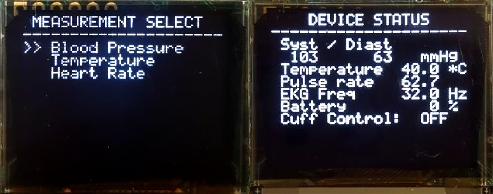
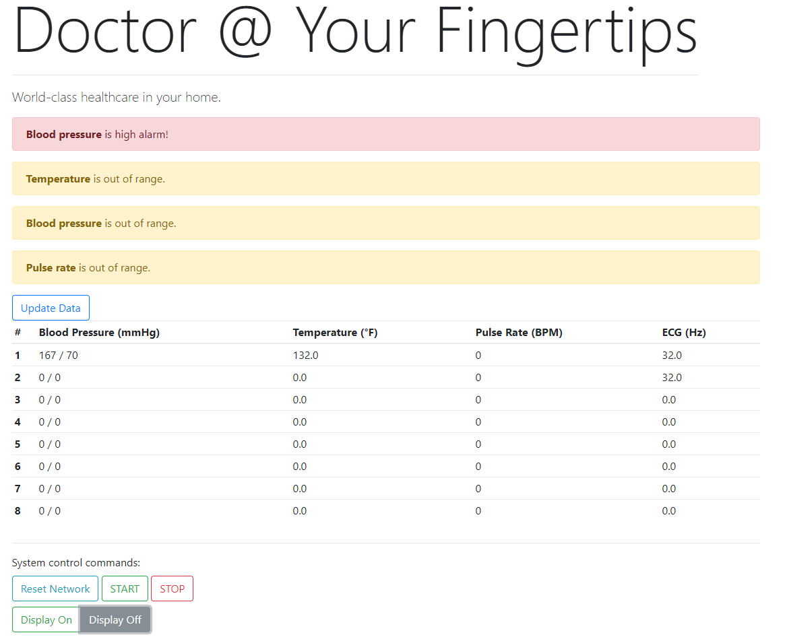
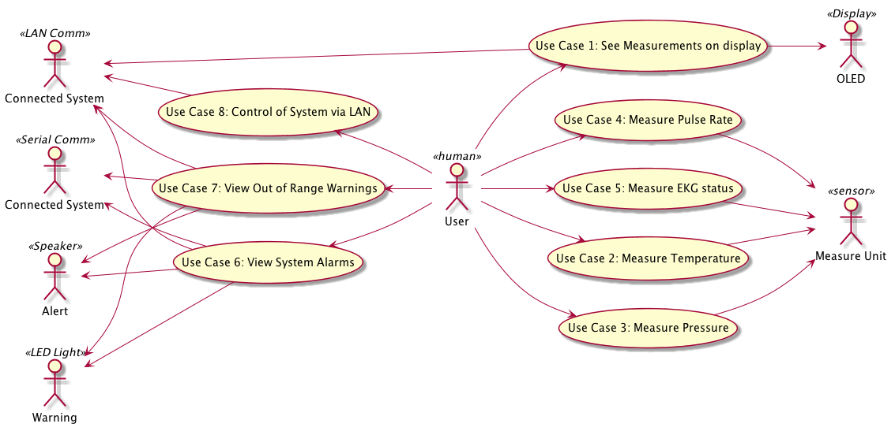
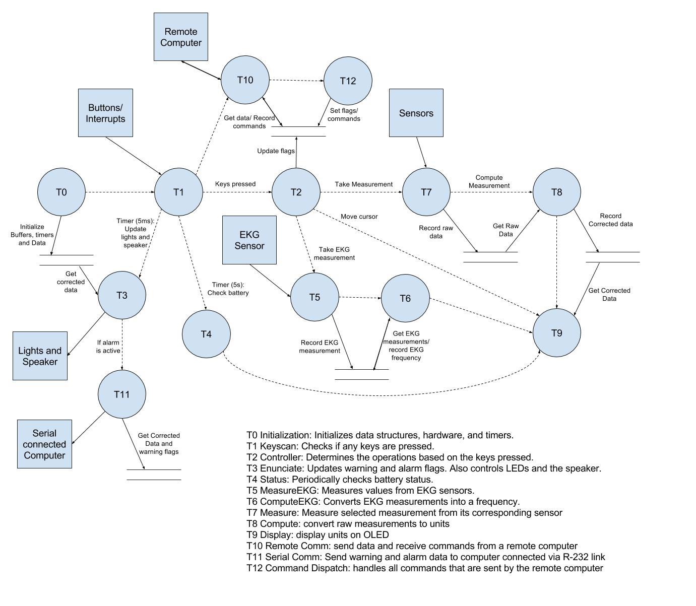

# Summary
Embedded systems firmware project designed to run on 
ARM Cortex M3 development board EK-LM3S8962.
Uses FreeRTOS to concurrently run driver, IP, and UI tasks at varying priority levels.

## LCD + Keypad User Interface 



## Web Interface



## Implemented Use Cases



## Data + Flow Control



## JSON REST Backend 

A driver was written for FreeRTOS+ TCP to read/write frames to Ethernet port.
To control the device, commands are issued via a simple JSON REST interface. Data is refreshed on every command:

```json
$ nc 10.0.1.10 80
GET /data HTTP/1.0
HTTP/1.0 200 OK
Content-Type: application/json; charset=utf-8
Connection: close

{
   "measurements": {
       "bloodPressure": [
           {
               "syst": 120,
               "dias": 80
           },
           {
               "syst": 120,
               "dias": 80
           }
       ],
       "temperature": [
           98.6,
           98.6,
           98.6
       ],
       "pulseRate": [
           60,
           70,
           80
       ],
       "ECG": [
           32.0,
           32.0
       ]
   },
   "warningAlarm": {
       "bpOutOfRange": true,
       "tempOutOfRange": true,
       "pulseOutOfRange": false,
       "bpHighAlarm": false,
       "tempHighAlarm": false,
       "pulseLowAlarm": false,
       "battLowAlarm": false
   },
   "boardState": {
       "displayEnabled": false
   }
}
```

